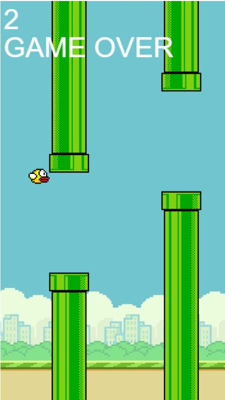

## Flappy Bird: A JavaScript Game

###### This JavaScript code implements a classic Flappy Bird game, where you control a bird and navigate it through gaps between pipes to score points. Avoid touching the pipes or the ground, or it's game over!

### Features:

- Intuitive Gameplay: Use the spacebar, up arrow, or "X" key to make the bird jump. - Simple controls for an engaging experience.
- Real-time Score: Your score is displayed in the top left corner, motivating you to beat your high score.
- Dynamic Pipe Placement: Pipes are randomly positioned with an opening for the bird to fly through, keeping the game challenging and unpredictable.
- Game Over State: The game ends when the bird collides with a pipe or the ground. - A clear "GAME OVER" message is displayed, along with the ability to restart the game.
- Clean and Maintainable Code: The code is well-structured, using comments for clarity and separation of concerns for easier future modifications.

### Getting Started

Prerequisites: Ensure you have a basic understanding of HTML, CSS, and JavaScript.

### Set Up Files:

- Create two files: flappybird.html and flappybird.js.
- Copy the HTML code provided in this README into flappybird.html.
- Copy the JavaScript code provided in this README into flappybird.js.

### Run the Game:

- Open the flappybird.html file in your web browser to start playing.

### Code Breakdown

The code is organized into several key functions:

- window.onload: This function executes when the web page finishes loading. It performs the following tasks:
- Retrieves a reference to the HTML canvas element with the ID "board".
- Sets the width and height of the canvas to create the game board.
- Obtains the 2D drawing context for the canvas, used for drawing game elements.
- Loads images for the bird, top pipe, and bottom pipe.
- Starts the game loop using requestAnimationFrame for smooth animation.
- Sets an interval to randomly place new pipes every 1.5 seconds.
- Adds an event listener for the "keydown" event to handle bird jumps.
  update: This function is called repeatedly within the game loop, responsible for updating the game state and drawing the game elements. Here's what it does:
- Clears the canvas to prepare for a new frame.
- Updates the bird's vertical position based on velocity and gravity. Ensures the bird stays within the canvas bounds.
- Draws the bird image on the canvas.
- Checks for game over conditions (bird colliding with the ground or top/bottom of a pipe).
- Loops through the pipeArray to update pipe positions and draw them on the canvas.
- Tracks score by incrementing it by 0.5 points when a bird successfully passes between a set of pipes.
- Cleans up pipes that move off the left side of the canvas.
- Displays the current score and "GAME OVER" message if applicable.
- placePipes: This function generates new pipe objects and adds them to the pipeArray at random intervals. It ensures there's sufficient space for the bird to fly through.
- moveBird: This function detects key presses (spacebar, up arrow, or "X" key) and triggers a bird jump by setting a negative velocityY for upward movement. It also resets the game if the jump occurs during a game over state.
  detectCollision: This function takes two objects as arguments and checks for collision using bounding box intersection logic. It returns true if a collision occurs, otherwise false.

### Customization

- You can modify the game's difficulty by adjusting the following:

1. velocityX: Controls the speed of pipe movement (higher values make the game harder).
2. gravity: Affects the strength of gravity pulling the bird downward.
3. openingSpace: Adjusts the gap size between the top and bottom pipes.

- Experiment with different bird and pipe image sizes for a unique visual style.
- Consider adding sound effects for jumps, collisions, and scoring for a more immersive experience.

###### I hope this README provides a clear and comprehensive overview of your Flappy Bird game code. Feel free to explore further customization and enhancements to personalize the game!

